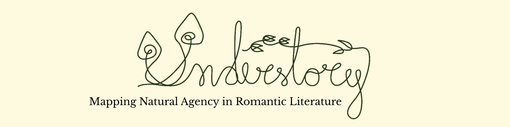

<div align="center">
  
</div>

---

## About

**Understory** is an NLP project applying computational methods to Romantic-era
English literature.

The project is named for the forest understory: the less visible layer where networks of life quietly unfold - a metaphor for uncovering hidden patterns within these texts.

## Corpus

13 passages spanning 6 authors, ~30,000 words total, sourced from Project
Gutenberg:

| Author | Works |
|---|---|
| Samuel Taylor Coleridge | The Rime of the Ancient Mariner |
| William Wordsworth | Tintern Abbey, Lines Written in Early Spring, The Tables Turned |
| Percy Shelley | Ode to the West Wind, Mont Blanc, The Cloud, To a Skylark |
| Mary Shelley | Frankenstein (Letters 1–4, Chapter 10) |
| Lord Byron | Childe Harold's Pilgrimage (Canto III), Manfred (Act I Scene II, Act II Scene II) |

## Pipeline

```
notebooks/setup.ipynb        →  download + clean corpus, cache BERT checkpoint
notebooks/annotation.ipynb   →  WordNet-based candidate pooling for annotation
        ↓
   (manual annotation, guided by docs/annotation_guideline.md)
        ↓
notebooks/model.ipynb        →  fine-tune BERT for NER, 5-fold cross-validation
notebooks/model_prediction.ipynb      →  run the final model over the unannotated corpus
```

Each notebook has one job and can be run independently, provided its
prerequisites have already been run once.

## Entity schema

| Category | Covers |
|---|---|
| **FLORA** | Trees, flowers, moss, woods, foliage |
| **FAUNA** | Animals, birds - literal, non-human creatures |
| **WEATHER** | Weather, atmospheric, and celestial phenomena |
| **LANDSCAPE** | Topographic and geological features, including named places |
| **NATURE** | Personified nature-as-force — abstract address, embodied spirit-characters, or pantheistic animating forces |

Full annotation methodology is documented in [`docs/annotation_guidelines.md`](docs/annotation_guidelines.md).
